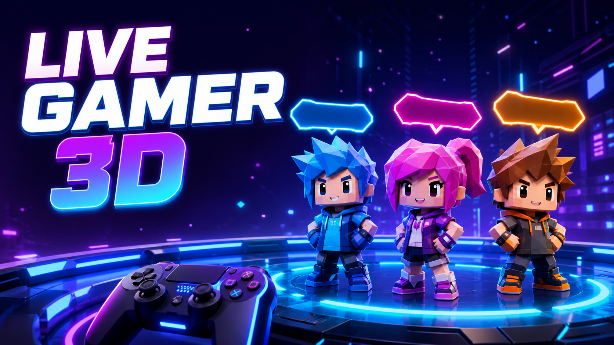

# Live Gamer 3D

Painel local em **Python/FastAPI + Three.js** para uma live no YouTube: cada pessoa que envia uma mensagem ao chat ao vivo aparece como um pequeno avatar 3D identificado pelo seu **nome público**.



> O YouTube não disponibiliza pela API de Live Chat a lista de espectadores que só assistem. Por isso este projeto não tenta identificar, rastrear ou armazenar visitantes silenciosos, IPs, mensagens ou dados privados. Ele trabalha apenas com autores públicos que efetivamente participam do chat.

## O que está pronto

- Palco Three.js responsivo em um mundo de primavera com relevo suave, lago animado, nuvens, caminho, pedras, arbustos, flores coloridas e árvores amareladas. Ele usa 18 modelos 3D CC0 do pacote Kenney já presente neste computador e mantém um avatar geométrico de reserva.
- Atualização em tempo real por WebSocket; um autor tem um só avatar, mesmo mandando várias mensagens.
- Caminhada esquelética real dos GLBs, exploração da ilha e interações em pares: os personagens percorrem pontos variados do mapa, aproximam-se, preservam espaço pessoal, encaram-se e alternam gestos sociais.
- Entradas configuráveis: apresentação individual, queda suave, portal giratório ou chegada direta. Saídas: caminhada, subida, portal ou desaparecimento imediato.
- Ranking dos cinco autores mais ativos dentro do próprio canvas transmitido, com a foto pública do perfil quando disponível e a inicial como reserva.
- Doações opcionais via Pix/Mercado Pago: QR dentro do quadro transmitido, consulta automática a cada 5 segundos e alerta 3D quando o pagamento é aprovado.
- Leitura local do chat público a partir do link da live, sem chave de API, cookies ou login. O leitor usa a continuação pública do próprio chat e respeita o intervalo indicado pelo YouTube.
- Modo de demonstração com botões separados para testar a entrada e a saída de um avatar sem limpar os demais.
- Captura ao vivo do canvas Three.js via `canvas.captureStream()` + FFmpeg + RTMPS. A imagem transmitida é o próprio palco onde os avatares aparecem; não há arquivo de vídeo de origem.
- Dois perfis 16:9 selecionáveis: **Econômico (854 × 480, 24 FPS, ~1,4 Mb/s)** e **Normal (1280 × 720, 30 FPS, ~3 Mb/s)**. Durante a live, a prévia usa o mesmo canvas enviado ao YouTube para evitar uma segunda renderização e mostrar o enquadramento exato da transmissão.
- Monitor de entrega que informa no painel quando o FFmpeg ou a conexão com o YouTube apresentam erro.

## Requisitos

- Python 3.11 ou superior.
- FFmpeg instalado e disponível no `PATH` para transmitir ao YouTube.
- Navegador com WebGL, `canvas.captureStream()` e `MediaRecorder`.

## Aplicativo Windows

Depois de instalar as dependências, execute `python -m app.desktop` para abrir o painel como um programa: uma janela própria exibe a interface Three.js, sem precisar abrir o navegador manualmente. Ao fechar a janela, o serviço local também é encerrado.

O aplicativo usa o Microsoft Edge WebView2 instalado no Windows. Se a janela não abrir em um computador, instale o [Microsoft Edge WebView2 Runtime](https://developer.microsoft.com/microsoft-edge/webview2/).

## Rodar localmente

No PowerShell, dentro desta pasta:

```powershell
python -m venv .venv
.\.venv\Scripts\Activate.ps1
pip install -r requirements.txt
Copy-Item .env.example .env
uvicorn app.main:app --reload --host 127.0.0.1 --port 8000
```

Abra [http://127.0.0.1:8000](http://127.0.0.1:8000). Sem configurar nada, use **Teste visual** para adicionar participantes fictícios.

## Ligar o chat real

1. Cole no painel o link público da live, por exemplo `https://www.youtube.com/live/mlKXjGTENNw`.
2. Opcionalmente, defina `YOUTUBE_LIVE_URL` no `.env` para conectar esse chat na inicialização.
3. Quando alguém escrever no chat público, o nome de exibição, a foto pública e o papel público (criador, moderador, membro ou participante) aparecerão no palco. A mensagem em si é descartada imediatamente.
4. O palco mantém até 10 participantes que já escreveram no chat. Depois disso, cada novo autor substitui somente o autor há mais tempo sem interagir, usando a animação de saída escolhida no painel. Nenhum participante removido é mantido no cache do navegador.

O leitor não acessa uma conta, não usa cookies e não consegue ler chat privado, bloqueado ou indisponível publicamente. Como a estrutura pública do YouTube pode mudar, o painel mostra um erro claro caso a leitura deixe de estar disponível.

## Enviar o palco 3D para o YouTube

1. Instale o [FFmpeg](https://ffmpeg.org/download.html) e deixe `ffmpeg` no `PATH`.
2. No YouTube Live Control Room, copie a URL **RTMPS** e gere/copIe uma chave de transmissão. Trate essa chave como senha: se vazar, redefina-a no YouTube Studio.
3. No `.env`, preencha `YOUTUBE_RTMPS_URL` e `YOUTUBE_STREAM_KEY`, ou cole somente a chave no formulário **Transmissão**. Nesse segundo caso, ela fica somente na memória do servidor e se perde quando ele é fechado.
4. Com o painel aberto, clique em **Iniciar transmissão**. O navegador captura em tempo real apenas o canvas Three.js do palco, envia os quadros ao servidor local e o FFmpeg os retransmite por RTMPS. Confirme a prévia no YouTube Studio antes de clicar em “Transmitir ao vivo”.
5. Escolha **Econômico** para upload limitado ou **Normal** para melhor definição. O ranking e o QR são compactos, renderizados em alta resolução e posicionados dentro da área segura do quadro.

Mantenha esta aba aberta durante a live: ela é o encoder da cena 3D. Os controles e o painel lateral não entram na imagem transmitida.

Os campos permanecem preenchidos depois de enviar os formulários, para facilitar novos testes e ajustes na mesma sessão.

## Receber doações via Pix com Mercado Pago

Esta função é opcional e não interfere no início da live.

1. Na opção **Live**, abra **Doações via Pix**, logo abaixo da chave de transmissão.
2. Informe seu **Access Token** privado do Mercado Pago, o valor fixo de cada doação e um e-mail válido exigido para criar a cobrança.
3. Clique em **Ativar QR Pix**. O QR aparece de forma compacta no canto inferior do canvas e também entra na captura enviada ao YouTube.
4. O servidor consulta o estado do pagamento a cada 5 segundos, sem webhook. Quando a cobrança é aprovada, dispara a animação de doação já existente e gera um novo QR. Cobranças expiradas após 30 minutos também são renovadas.
5. Para remover o QR durante a sessão, abra novamente a opção e clique em **Desativar**.

O Access Token permanece somente na memória do servidor e nunca é retornado ao navegador. A interface recebe apenas o estado sanitizado e a imagem pública do QR. Credenciais atuais `APP_USR` usam a API de Orders recomendada; credenciais de teste antigas com prefixo `TEST-` usam automaticamente a compatibilidade da Payments API. Em produção, use o Access Token produtivo da sua própria conta e mantenha uma chave Pix cadastrada no Mercado Pago.

Como o QR é público e não possui um formulário anterior ao pagamento, o alerta usa o nome retornado pelo Mercado Pago quando disponível; caso contrário, mostra **Apoiador via Pix**. O e-mail informado serve para a criação técnica da cobrança e não é exibido na live.

## Limites de segurança e privacidade

- Não há lista de viewers silenciosos: isso não é um dado exposto pelo endpoint de chat.
- O app não persiste participantes, mensagens, IPs, cookies, imagens de perfil nem chaves de API; tudo some quando o servidor é parado ou o palco é limpo.
- O monitor do Mercado Pago não usa webhook: apenas o servidor local consulta a cobrança ativa, de cinco em cinco segundos.
- Não publique esta interface em uma URL pública sem autenticação, HTTPS e uma revisão de segurança. Ela foi pensada para operar em `127.0.0.1`.
- Se a chave de transmissão foi mostrada ou enviada a alguém, redefina-a no Live Control Room imediatamente.

## Recursos de terceiros

Os 18 personagens são do pacote **Blocky Characters**, de [Kenney](https://kenney.nl/), distribuído sob **CC0 1.0**. A licença original está em `kenney_blocky-characters_20/License.txt`.

Referências: [Pix via Orders API do Mercado Pago](https://www.mercadopago.com.br/developers/pt/docs/checkout-api-orders/payment-integration/pix), [embed de chat ao vivo do YouTube](https://support.google.com/youtube/answer/2474026) e [RTMPS no YouTube](https://support.google.com/youtube/answer/10364924).
